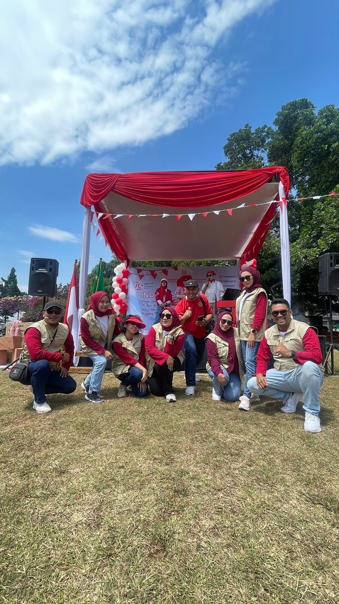

Pada tanggal 29 Agustus 2024, Ikatan Notaris Indonesia Pengurus Wilayah Jawa Barat mengadakan acara untuk memperingati Hari Kemerdekaan Republik Indonesia yang ke-79. Acara ini dilaksanakan di Bumi Sangkuriang, Bandung, dan dihadiri oleh berbagai perwakilan dari seluruh daerah di Jawa Barat, termasuk Pengurus Daerah Kabupaten Garut.

Peringatan ini diisi dengan berbagai kegiatan yang meriah dan penuh semangat nasionalisme. Salah satu momen yang paling berkesan adalah upacara bendera, di mana bapak Ebbu Setiabudi, SH, MKn, perwakilan dari Kabupaten Garut, bertindak sebagai komandan upacara. Penampilan beliau yang tegas dan khidmat memberikan kesan yang mendalam bagi seluruh peserta yang hadir.

Selain upacara bendera, acara ini juga dimeriahkan dengan berbagai perlombaan rakyat yang menarik dan penuh keceriaan. Berbagai cabang lomba seperti balap karung, tarik tambang, dan lomba makan kerupuk berhasil menghidupkan suasana perayaan kemerdekaan. Tim dari Pengurus Daerah Kabupaten Garut menunjukkan prestasi gemilang dengan meraih juara di beberapa bidang perlombaan tersebut.

Prestasi yang diraih oleh tim Pengda Garut menjadi kebanggaan tersendiri dan menambah semarak acara peringatan hari kemerdekaan ini. Keberhasilan ini juga menunjukkan semangat kebersamaan dan kerja keras dari seluruh anggota tim.

Acara peringatan hari kemerdekaan RI ke-79 ini tidak hanya menjadi ajang untuk mengenang jasa para pahlawan, tetapi juga menjadi wadah untuk mempererat tali persaudaraan dan kebersamaan antar anggota Ikatan Notaris Indonesia di wilayah Jawa Barat. Dengan semangat kemerdekaan yang terus berkobar, diharapkan seluruh anggota INI dapat terus berkontribusi positif bagi masyarakat dan bangsa Indonesia.

